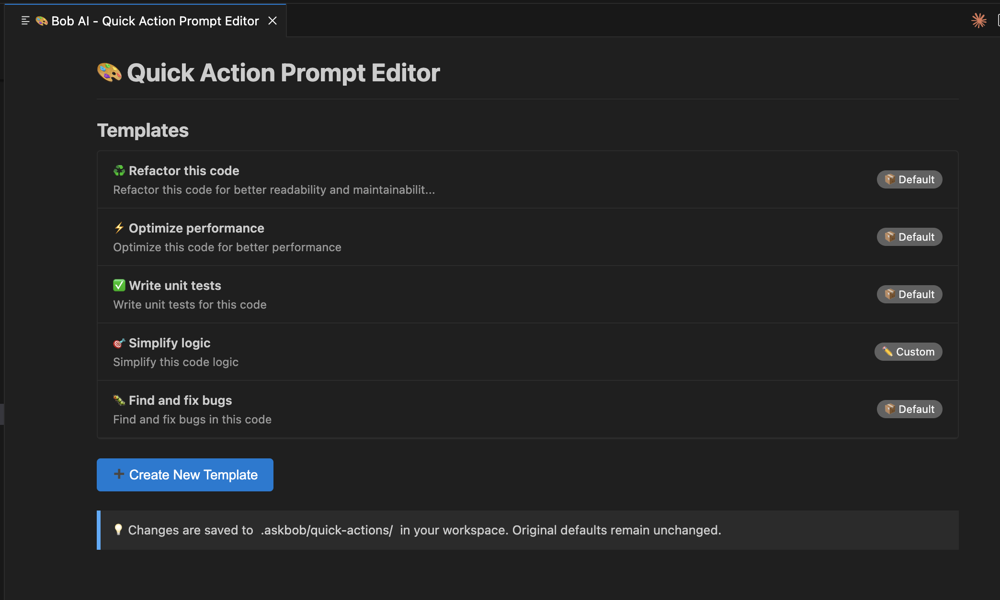

# 🤖 Bob AI CLI Extension

<div align="center">

**Your AI coding buddy, right in VS Code** ⚡


[](https://marketplace.visualstudio.com/items?itemName=1031022.bob-ai-cli)

*Select code. Hit a key. Let AI do the heavy lifting.*

</div>

---

## 🎯 What's This?

Bob AI connects VS Code to AI CLIs like **Claude Code** and **Gemini CLI**. Select code, press a shortcut, and boom—AI suggestions, refactors, tests, you name it.

**Zero config. Pure speed. Maximum fun.** 🚀

*Includes delightful sound feedback (toggle on/off in settings)*

---

## ⚡ Keyboard Shortcuts (ASDF Home Row)

The fastest way to use Bob AI—your fingers never leave home row!

| Keys | Mac | What it does |
|------|-----|--------------|
| `Ctrl+K A` | `Cmd+K A` | 🎯 **Quick Actions** menu |
| `Ctrl+K D` | `Cmd+K D` | 📤 **Send** to terminal |
| `Ctrl+K F` | `Cmd+K F` | 📋 Copy **reference** |
| `Ctrl+K G` | `Cmd+K G` | 🚀 Start AI CLI |
| `Ctrl+K I` | `Cmd+K I` | 🖼️ Send **image file** to terminal |
| `Ctrl+Shift+K I` | `Cmd+Shift+K I` | 📋 Paste **clipboard image** (NEW!) |

**Pro tip:** Just select code and mash `Ctrl+K A` (or `Cmd+K A` on Mac). Choose your action. Done. ⚡

---

## 🎨 Quick Actions Menu

Hit `Ctrl+K A` and choose:

- 🔍 **Explain this code** - Get the breakdown
- 🐛 **Find and fix bugs** - Catch issues fast
- ♻️ **Refactor this code** - Clean it up
- ✅ **Write unit tests** - Auto-generate tests
- 📝 **Add documentation** - JSDoc magic
- ⚡ **Optimize performance** - Make it faster
- 🔒 **Security review** - Find vulnerabilities
- 🎯 **Simplify logic** - Untangle spaghetti code

---

## 📁 Folder Operations

Right-click any folder/file in Explorer → **"Bob AI: Actions"** for quick operations:

### ✨ Quick Actions (Template-based)
Choose from customizable templates:
- 📖 **Explain This** - Get AI explanation of folder structure & purpose
- 🔍 **Review Code** - Comprehensive code review
- 🔬 **Deep Code Review** - Expert review with confidence-based filtering (≥80 threshold)
- 🐛 **Find Bugs** - Analyze for potential issues
- ✅ **Generate Tests** - Create test coverage
- 📝 **Add Documentation** - Generate or improve documentation
- ♻️ **Refactor** - Get refactoring suggestions
- 📂 **Show Structure** - Show file tree + send to AI CLI

### 📋 Copy Code Reference
Copy clean references to folders or files:
- **Folders:** `@src/components/`
- **Files:** `@src/utils/helper.js`

Perfect for analyzing entire features, reviewing modules, or understanding unfamiliar code! 🚀

**Customize:** Create your own folder action templates in `.askbob/folder-actions/` - just like Quick Actions!

---

## 🖼️ Working with Images

Send images to Claude Code for visual context and analysis!

### ⚡ NEW: Paste from Clipboard (Phase 2!)

**Fastest way to send screenshots:**
```bash
1. Take screenshot (Cmd+Shift+4 / Win+Shift+S)
2. Press Ctrl+Shift+K I
3. Preview opens → Click "Send to Terminal"
4. Done! (2 seconds total)
```

**Features:**
- ✅ Preview image before sending
- ✅ No need to save file first
- ✅ Temp files saved to `~/.bob-ai/temp/`
- ✅ Manual cleanup command

### Quick Image Send (Files)

- **Right-click** any image file in Explorer → "Bob AI: Send Image to Terminal"
- **Keyboard:** Select image → Press `Ctrl+K I` (or `Cmd+K I`)

### Supported Formats
`.png` `.jpg` `.jpeg` `.gif` `.svg` `.webp` `.bmp`

### Use Cases

- 🐛 **Debug UI issues** - Send screenshots of broken layouts
- 🎨 **Implement designs** - Share mockups and get code suggestions
- 📊 **Analyze diagrams** - Get help understanding architecture
- 🖥️ **Explain errors** - Screenshot error messages for analysis
- 🔍 **Code reviews** - Show before/after UI comparisons

**Example Workflow (Clipboard):**
```bash
1. See UI bug → Take screenshot (auto-copies to clipboard)
2. Press Ctrl+Shift+K I
3. Preview appears → Click "Send"
4. Ask: "Why is this button misaligned?"
```

**Example Workflow (File):**
```bash
1. Save screenshot to workspace/screenshots/
2. Right-click → "Bob AI: Send Image to Terminal"
3. Ask: "How do I fix this layout?"
```

**Pro tip:** Combine images with code references for full context!
```bash
Select code → Ctrl+K D
Press Ctrl+Shift+K I → Send clipboard image
Add your question
```

**Cleanup temp images:**
```bash
Command Palette → "Bob AI: Clean Up Temp Images"
Choose: Delete All, 7 days, 30 days, or Open Folder
```

**Learn more:** See [Working with Images Guide](./docs/user-guide/WORKING_WITH_IMAGES.md) for detailed examples and workflows.

---

## 🚀 Quick Start

### 1. Install
```bash
vsce package
# Install the .vsix from Extensions panel
```

### 2. Select Some Code
```typescript
function fibonacci(n: number): number {
    if (n <= 1) return n;
    return fibonacci(n - 1) + fibonacci(n - 2);
}
```

### 3. Press `Ctrl+K A` (or `Cmd+K A`)

### 4. Pick "🔍 Explain this code"

### 5. Watch the magic ✨

Bob sends this to your AI CLI:
```
Explain this code @src/math.ts#L1-5 \
```

Your AI explains it line-by-line. Beautiful.

---

## 🎪 All Commands

### Main Commands

| Command | Shortcut | What it does |
|---------|----------|--------------|
| Quick Actions | `Ctrl+K A` | Template prompt menu |
| Send to Terminal | `Ctrl+K D` | Just the reference |
| Copy Reference | `Ctrl+K F` | Copy `@path#L1-5` |
| Start AI CLI | `Ctrl+K G` | Launch Claude/Gemini |
| Send Image | `Ctrl+K I` | Send image to terminal |
| Toggle Sound Effects | - | Enable/disable sound feedback |

### Advanced Features

- **💡 Lightbulb Quick Fixes** - Click 💡 icon for inline AI suggestions
- **📁 Folder Operations** - Right-click folders for module-level AI operations
- **📋 Add Feature** - Guided tech spec creation workflow
- **⚙️ Execute Plan** - Implement from `.md` tech specs
- **🔒 Terminal Management** - Auto-detects when AI CLI closes

---

## ⚙️ Settings & Customization

### 🔊 Sound Effects

Bob AI includes delightful birds chirping sound feedback when you execute commands! Control it your way:

**Toggle via Command Palette:**
1. Press `Ctrl+Shift+P` (or `Cmd+Shift+P` on Mac)
2. Type "Bob AI: Toggle Sound Effects"
3. Press Enter to enable/disable

**Configure in Settings:**
1. Open Settings: `Ctrl+,` (or `Cmd+,` on Mac)
2. Search for "Bob AI CLI"
3. Check/uncheck "Enable Sound Effects"

**Or edit settings.json directly:**
```json
{
  "bobAiCli.enableSoundEffects": true  // or false to disable
}
```

**Default:** Sound effects are **enabled** by default. Turn them off if you prefer silent operation!

### ✏️ Customize Quick Action Prompts

Bob AI lets you customize **both** Quick Action prompts (for code selections) **and** Folder Action templates (for files/folders)! Edit templates, create new ones, or reset to defaults.

**Edit Quick Actions (Code Selections):**
1. Press `Ctrl+Shift+P` (or `Cmd+Shift+P` on Mac)
2. Type "Bob AI: Edit Quick Action Prompts"
3. Choose your editing mode:
   - **🎨 Open Visual Editor** (Recommended) - Edit templates in a friendly UI
   - **📄 Edit Files Directly** - Open template files in your editor
   - **📁 Open .askbob Folder** - Browse all customizations

**Edit Folder Actions (Files/Folders):**
1. Press `Ctrl+Shift+P` → "Bob AI: Edit Folder Action Templates"
2. Or right-click any folder → "Bob AI: Actions" → "Bob AI: Edit Folder Action Templates"
3. Same visual editor with support for `{{type}}` and `{{path}}` variables

**Visual Editor Features:**
- ✨ Edit any template with live preview
- ➕ Create new custom templates with intuitive form interface
- 🎯 Auto-selection of newly created templates
- 🔄 Reset to default anytime
- 🗑️ Delete custom templates
- 💾 Auto-saves and reloads instantly
- ✅ HTML5 validation for template filenames

**Creating New Templates:**

When you click "➕ Create New Template", you'll see an intuitive form with:
- **Filename field** - Auto-validates (lowercase, letters, numbers, hyphens only)
- **Label field** - Display name with emoji support
- **Kind selector** - Choose template category (Quick Fix, Refactor, etc.)
- **Prompt editor** - Large text area with variable hints
- **Variable documentation** - Built-in hints for `{{code}}`, `{{type}}`, `{{path}}`
- **Instant feedback** - Template appears in list immediately after creation

No popup dialogs or browser prompts - everything works seamlessly in the webview!



**Your customizations are stored in:**
```
.askbob/quick-actions/    # Quick Actions (code selections)
.askbob/folder-actions/   # Folder Actions (files/folders)
```

All customizations are automatically git-ignored by default. Perfect for personal preferences!

**Template Variables:**

*Quick Actions (Code Selections):*
- `{{code}}` - Selected code reference (e.g., @file.js#L10-15)

*Folder Actions (Files/Folders):*
- `{{type}}` - "module" (folders) or "file" (files)
- `{{path}}` - Relative path to the resource

**Learn more:** See [📘 User Guide](./docs/user-guide/CUSTOMIZING_TEMPLATES.md) • [🏗️ Architecture](./docs/technical/TEMPLATE_ARCHITECTURE.md) • [📚 All Docs](./docs/)

---

## 📦 Installation

### Option 1: VS Code Marketplace (Recommended)

**[Install from VS Code Marketplace](https://marketplace.visualstudio.com/items?itemName=1031022.bob-ai-cli)**

Or search "Bob AI CLI" in VS Code Extensions panel.

### Option 2: From Source
```bash
git clone https://github.com/sayurbox/ask-bob-ai.git
cd ask-bob-ai
npm install -g @vscode/vsce
vsce package
# Install .vsix in VS Code Extensions panel
```

### Requirements for Clipboard Image Support

**Linux Users Only:**
```bash
# Ubuntu/Debian
sudo apt-get install xclip

# Fedora/RHEL
sudo yum install xclip

# Arch Linux
sudo pacman -S xclip
```

**macOS & Windows:** No additional requirements (built-in clipboard support)

---

## 🎨 Code Reference Format

Bob uses clean references that AI loves:

```
@src/components/Button.tsx#L15-42
```

**Single line:** `@src/utils/helper.js#L42`
**Multi-line:** `@src/components/Header.tsx#L15-28`

Copy, paste, send. Works everywhere. ✅

---

## 🤝 Compatible With

| AI CLI | Status |
|--------|--------|
| **Claude Code** | ✅ Fully Supported |
| **Gemini CLI** | ✅ Fully Supported |
| **Custom CLIs** | ✅ Supported |
| **Any Terminal** | ✅ Fallback mode |

---

## 💡 Pro Tips

### Tip 1: Multi-file Context
```bash
# Build context across files
1. Select code in file1.js → Ctrl+K F (copy)
2. Select code in file2.js → Ctrl+K F (copy)
3. Paste both in terminal with your prompt
4. AI now sees the full picture!
```

### Tip 2: Custom Templates
Use the Visual Editor to create your own quick actions:
```bash
1. Press Ctrl+Shift+P → "Bob AI: Edit Quick Action Prompts"
2. Choose "🎨 Open Visual Editor"
3. Click "➕ Create New Template"
4. Fill in the form:
   - Filename: convert-typescript (auto-validated)
   - Label: 🔄 Convert to TypeScript
   - Prompt: Convert this code to TypeScript: {{code}}
5. Click "✅ Create Template" - it auto-selects and is ready to use!
6. Use it instantly in Quick Actions with Ctrl+K A!
```

### Tip 3: Tech Spec Workflow
```bash
# Plan before you code
1. Right-click → "Bob AI: Add Feature"
2. Answer questions (feature name, requirements, etc.)
3. Get tech spec in /research/research-{feature}.md
4. Right-click .md → "Bob AI: Execute Plan"
5. Watch Bob implement it!
```

### Tip 4: Folder Operations for Quick Understanding
```bash
# Quickly understand unfamiliar modules
1. Right-click any folder → "Bob AI: Folder Operations"
2. Choose "📖 Explain module"
3. Get instant overview of architecture & purpose
4. Use "📂 List files" to see the file structure first
```

---

## 🔧 Development

```bash
# Clone & open
git clone https://github.com/sayurbox/ask-bob-ai.git
cd ask-bob-ai

# Test (press F5 in VS Code)
# Or package and install
vsce package
```

**Architecture:** Pure JavaScript • Zero dependencies • Modular design • Lightning fast

---

## 🎯 Roadmap

**✅ Done:**
- [x] ASDF keyboard shortcuts
- [x] Tech spec workflow
- [x] Terminal lifecycle tracking
- [x] Lightbulb quick fixes
- [x] Folder operations (module-level AI analysis)
- [x] Deep Code Review with confidence filtering
- [x] VS Code Marketplace
- [x] Streamlined command set (6 core commands)
- [x] Sound effects with customizable settings
- [x] Custom template UI with visual editor
- [x] Folder action templates (customizable like Quick Actions)
- [x] Copy code reference for files/folders
- [x] Visual editor for folder action templates
- [x] Template variables for Quick Actions (`{{code}}`)
- [x] Template variables for Folder Actions (`{{type}}`, `{{path}}`)
- [x] HTML form-based template creation (no browser prompts)
- [x] Auto-selection of newly created templates
- [x] Template filename validation and sanitization
- [x] Image attachment support (send screenshots to Claude Code)
- [x] Image file path references for visual context
- [x] Clipboard image paste with preview (Phase 2)
- [x] Temp file management with manual cleanup
- [x] Image preview WebView before sending

**🚧 Coming Soon:**
- [ ] Context builder (code + images + prompts) (Phase 3)
- [ ] Multi-file references
- [ ] Response preview in editor
- [ ] Claude Code skills integration

---

## 🐛 Issues?

[Open an issue](https://github.com/sayurbox/ask-bob-ai/issues/new) with:
- Your OS & VS Code version
- Steps to reproduce
- What you expected vs what happened

We'll fix it! 💪

---

## 📜 License

MIT - Go wild! 🎉

---

<div align="center">

**Made with ❤️ for devs who love AI**

Press `Ctrl+K A` and let Bob do the work

[⭐ Star](https://github.com/sayurbox/ask-bob-ai/stargazers) • [🐛 Issues](https://github.com/sayurbox/ask-bob-ai/issues) • [💡 Ideas](https://github.com/sayurbox/ask-bob-ai/issues) • [📦 Marketplace](https://marketplace.visualstudio.com/items?itemName=1031022.bob-ai-cli)

</div>
